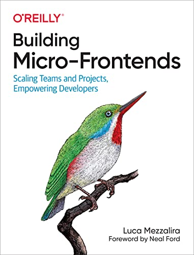
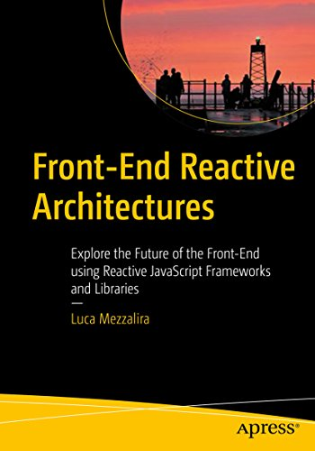
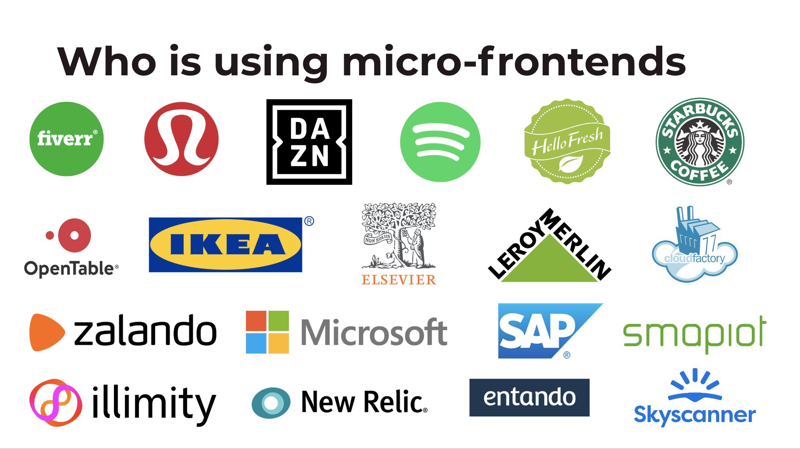
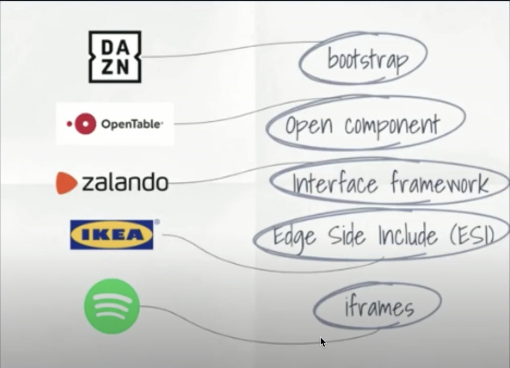
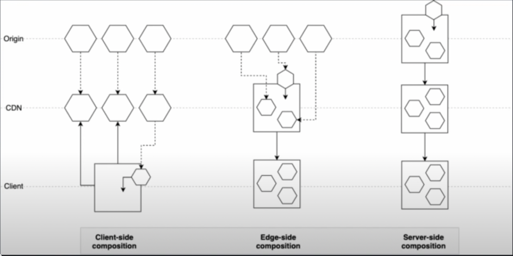

# **Micro Frontends**

### **What do we talk about**

What is a Micro Frontends Architecture  
Why the exist  
How to build a micro frontend

               
               
               
 

_[Luca Mezzalira](https://lucamezzalira.com)_

Principal Solutions Architect at AWS,  
International Speaker, O'Reilly author

   

                   

## What is a Micro Frontends Architecture

its trying to think of a website as **project or page** of composed features that are owned by independent teams

               
               
               
               
       

  

**Horizontal**

               
           

  

**Vertical**

               
         

## Benefits of micro frontends

-   Independent deployments
-   Independent updates and bug fixes
-   Tech stack freedom
-   Independent decoupled units
-   Application split by business domain

               
               
         

   

               
               
   

## Why the exist

               
             

   

               
               

## How to build a micro frontend

               
               
         

         

## Define

#### define what how you want the micro frontend split for your project

#### horizontal (netflix) || vertical (tesco)

   

## Compose

#### define what how you want the micro frontend split for your project

               
     

## Routing

#### define how to micro frontend handle routing

 

## Communication

#### define how to micro frontends handle communicate

               
               
       

## client side tools

-   [Module Federation (webpack 5 plugin)](https://webpack.js.org/concepts/module-federation/)
-   [single-spa](https://single-spa.js.org/)
-   [frint.js](https://frint.js.org/)
-   [luigi](https://luigi-project.io/)
-   [qiankun](https://qiankun.umijs.org/)
-   [puzzle-js](https://github.com/puzzle-js/puzzle-js)

## server side tools

-   [Module Federation (webpack 5 plugin)](https://webpack.js.org/concepts/module-federation/)
-   [ara-framework](https://ara-framework.github.io/website/)
-   [opencomponents](https://opencomponents.github.io/)
-   [piral](https://piral.io/)
-   [tailor](https://github.com/zalando/tailor)

## versioning

-   [bit-cloud](https://bit.cloud/)
-   [bit-dev](https://bit.dev/)

               
         

## Webpack

               
             

## Webpack Module Federation

               
               
